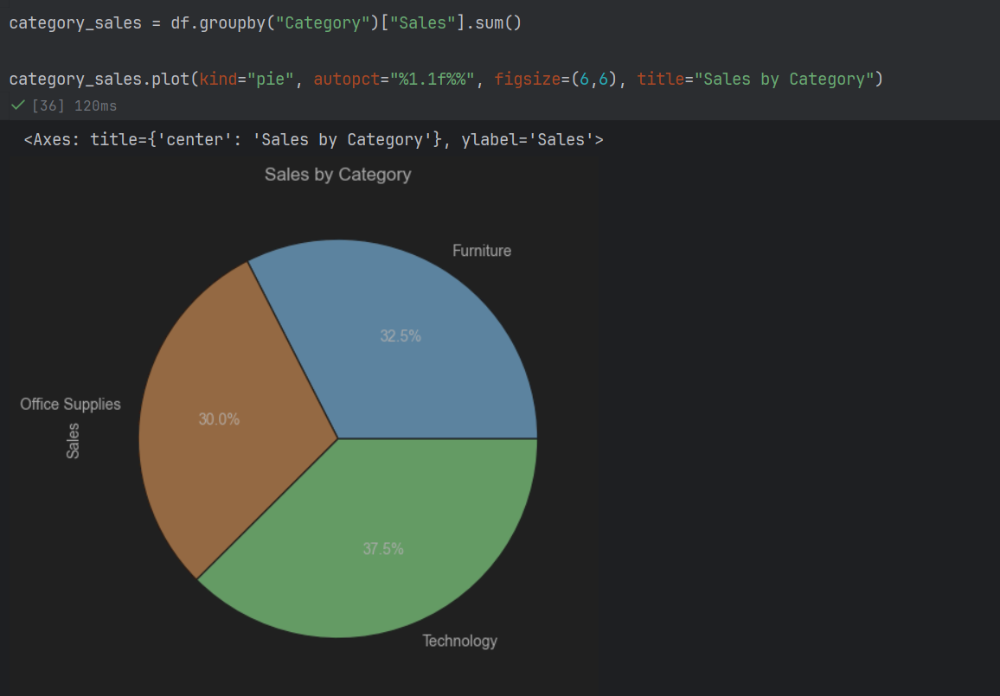
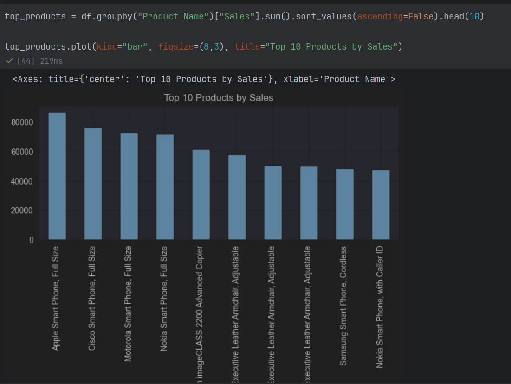
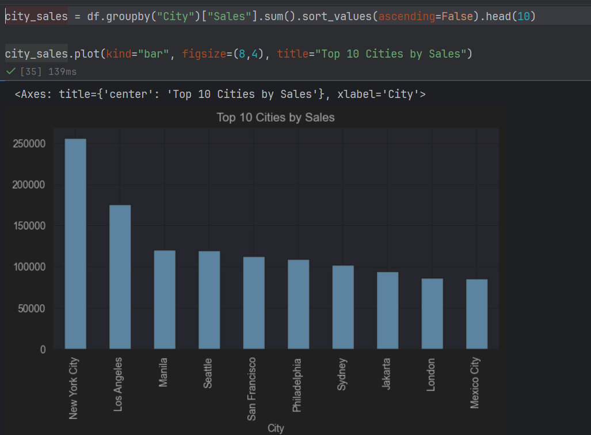

# Sales Data Analysis using Python

## Project Overview

This project analyzes a retail sales dataset using Python to identify sales trends, profit growth, and dataset quality. The analysis includes data exploration, data cleaning, and visualization using Pandas, NumPy, and Matplotlib.

## Objective

- Analyze sales performance over the years.
- Examine yearly profit trends.
- Perform data quality checks.
- Perform Exploratory Data Analysis (EDA).

## Tools & Technologies

- Python
- Pandas
- NumPy
- Matplotlib
- Jupyter Notebook

## Dataset Information

- Total Records: 51,290
- Total Columns: 23
- File Format: CSV

## Analysis Performed

- Dataset Preview
- Dataset Information
- Missing Value Check
- Duplicate Value Check
- Sales Analysis by Year
- Profit Analysis by Year

## Key Insights

- Sales increased consistently over the years.
- Profit showed positive growth.
- No duplicate records were found.
- The dataset was suitable for analysis.

## Project Structure

```text
Sales-Data-Analysis-Python/
├── Sales_Data_Analysis.ipynb
├── Sales Dataset DA.csv
└── README.md
```

## Author

Shruti Sharma

Aspiring Data Analyst | Python | SQL | Excel | Power BI




## Sales by Product


## Sales by City

